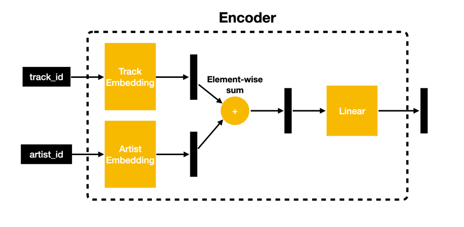
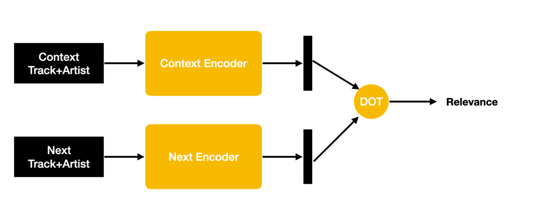
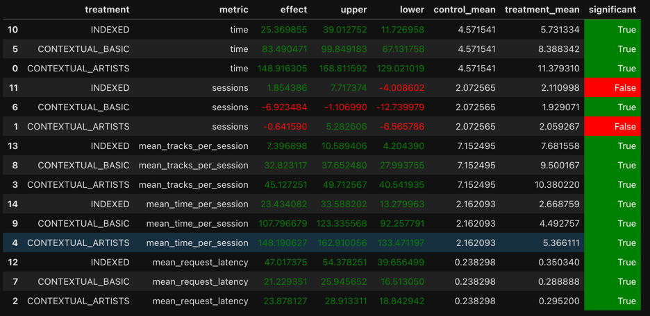

# Очет по домашнему заданию №1

**Инструкция по запуску находится тут [инструкция](HOW_TO_RUN.md)**
**Блокноты с обучением и АБ-тестом лежат в [этой же папке]()**

## 1. Abstract

Основная идея - улучшение контекстного рекомендера за счет добавления информации об авторе трека. До этого мы не пользовались информацией о том, что у нескольких треков может быть один автор - следовательно они могут быть довольно похожими. Кроме того были произведены экспрерименты с архитектурами.

## 2. Детали

Конечное решение выглядит так:

Есть энкодер, который совмещает информацию о треке и авторе в один эмбеддинг

Далее есть 2 таких энкодера для эмбеддинга контекста и для эмбеддинга следующего трека. Полученные эмбеддинги скалярно перемножаются и на выходе имеем оценку релеваности слеждующего трека к контексту.

Обучалось это через MSE + Adam на парах (контекст, другой трек из сессии) как на семинаре про нейрорекомендеры.

Пробовал углублять, добавлять дроупауты и батчнормы, менять активации, обучать c BCE лоссом. Ничего не дало результаты лучше, чем в представленном решении.

## 3. A/B Experiment

Для краткости завел эксперимент на 3 рекомендера:
1. INDEXED
2. CONTEXTUAL_BASIC - простой нейрорекомендер как на семинаре (лучший из тех что был на момент 5-го семинара)
3. CONTEXTUAL_ARTISTS - моя реализация с добавлением информации о артисте

